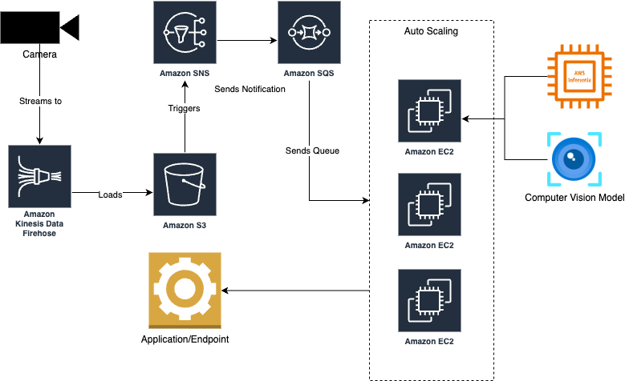

# DiUS Interview - Kin Lee

## Part 1
### Exploration 
`exploration.ipynb` contains the exploration code for the data and the training process for the model. This includes processes like data pre-processing, hyperparameter tuning (Grid Search) and Evaluation (MAE). To run this notebook, install the packages in the `requirements.txt` file.
### Findings
Mean Absolute Error from the best Neural Network was **6.39**, evaluated from the test set. Predictions have been saved to `test_pred.csv` alongside the original test dataset for comparison.
### Serving
The `app/` directory contains all the files that the `Dockerfile` will copy to serve the model. You can build and run the image with 
```
docker build -t <YOUR_APP_NAME> .
docker run <YOUR_APP_NAME>
```
### Question - If you had flexibility to choose a model to tackle this problem, what model would that be?
Although using a deep learning model to predict Y was highly accurate, I would still opt for a simpler model like an XGBoost regressor for the reasons below.

1. **Size and nature of the dataset** - As we're only training on 14k  records which are tabular, Neural Networks may not be the best choice as they usually perform better when fed with larger datasets that are unstructured like images and text.
2. **Tradeoff between Accuracy VS Computation** - Running a simple XGBoost Regressor on the dataset, I got a result of a MAE score of **10.68**, which compared to the Neural Network score, is not much worse off given the computing complexity difference between the two models. 
3. **Interpretability of Model** - Understanding an XGBoost model is often times a lot easier than understanding a Neural Network, using tools like SHAP to provide feature importance in the model. 


## Part 2
### Scenario
A surveillance camera company uses computer vision to detect objects and people in live footage. They are already using a computer vision model on ec2 (cpu) instances with autoscaling and processing the videos in near real time and they process the frames of the landed videos using one second frequency sampling. Their model works accurately, but as a result of company growth their AWS spending has been increasing rapidly. Now they would like to reduce their cost.

What would you suggest for them to do first? Is there a rough architecture that you can come up with to solve this problem on AWS?

### Response
#### Information Gathering
As a first step, I would start by gathering information from the company to better understand their requirements and current solution. Things that would be good to know are:
1. What type of EC2 instances are being used?
- If only on-demand instances are used, there may be opportunities to identify cases where spot or reserved instances might be better.
2. What are their typical usage patterns? 
-  This would help to check if the auto-scaling policies are scaling correctly with their usage, e.g. High activity in the day vs low activity at night.
- It would also potentially allow planning of reserved instances to be used.
3. Where are the surveillance cameras usually set up? 
- This would help decide the best granularity to process video frames.
- If a camera is set up in a high traffic venue, processing frames at a higher granular level would be warranted, as opposed to a low traffic venue with minimal activity.
4. What are their performance requirements for outputs?
- We want to identify what are the critical and non-critical workloads as it identify some opportunities to introduce spot instances for non-critical workloads.
5. What happens to old video footage that is stored
- As video data is large, accumulating this in near real time could be a costly storage operation.

#### Actionable Suggestions
Once I have gathered the information detailed above, I would suggest a few actions they can take to start optimising their costs.

1. Frame Sampling Optimisation
-  If cameras are set up in low traffic areas like rural convenience stores or restaurants, a 1 second frame frequency sampling may be a bit of an overkill as the intervals may not be enough to capture new objects in the frames.  Increasing the frame frequency sampling to 5 seconds would significantly reduce the inference cost to the computer vision model, which may help reduce overall cost.
2. Switching from CPU based instances to GPU instances
- To address increasing costs due to intensive computer vision tasks, consider leveraging GPU instances over CPUs. GPUs offer superior parallel processing capabilities, enabling efficient handling of tasks. While GPU instances may have higher per-instance costs, they require fewer instances to complete computer vision tasks, resulting in overall cost savings. Pairing this with Amazon Inferentia, this could save the company a significant amount of cost.
3. Data Storage Optimisation
- As we will be storing huge volumes of data, due to processing footage in near real time, storage costs may inflate quickly if we don't monitor costs. Using S3 as our primary blob storage, we should ensure that lifecycle policies are in place to move old/archived video footage to lower-cost storage classes like S3 Glacier, or even just deleting them if persistence is not required.

#### Extra Considerations
1. Going Serverless (EC2 vs Lambda)
- A serverless option could be considered if traffic arrives in period intervals and there is a low amount of total request to the Computer Vision model.
- However a limitation of using Lambda is that there is a cap on execution duration and resource allocation, requiring further optimisation
- EC2 on the hand would require more frequent patching and instance upgrades since they are not managed services.
2. Content Delivery Network (CDN)
- If video footage need to be frequently accessed by end-users, using a CDN service like Amazon Cloudfront could be considered to cache video data, especially if users want to rewind video footage to see the object/people detection.
3. Batch Processing Frames
- Instead of processing frames individually, processing frames in batches may prove more cost efficient, especially with dealing with highly parallelizable task such as image processing. We can utilise services like AWS Batch for managing batch processing workloads.
4. Consideration of SNS and SQS

#### High Level Architecture
With all the information gathered and the suggestions above, the high level solution diagram below should highlight what the architecture might look like.


